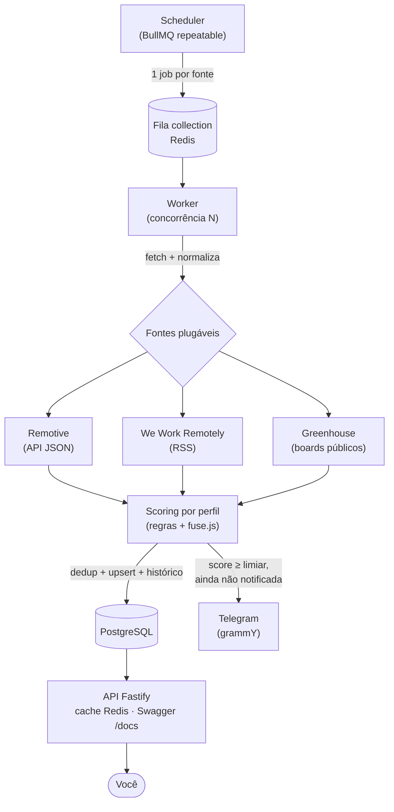

# Profile Match

[](https://github.com/LucasGola/profile-match/actions/workflows/ci.yml)

> Agregador inteligente de vagas: coleta de múltiplas fontes legítimas, normaliza,
> deduplica, pontua a aderência ao seu perfil e notifica apenas o que importa —
> tudo exposto por uma API própria.

O foco do projeto é a **engenharia em volta** da feature: coleta concorrente e
resiliente, processamento assíncrono com fila e workers, modelagem de dados,
matching explicável (sem ML), API cacheada, testes, CI/CD e deploy.

> 🚧 **Em desenvolvimento ativo.** Já concluído: fundação (Milestone 0), slice
> vertical de coleta (Milestone 1), coleta assíncrona/concorrente com fila e
> workers a partir de 3 fontes (Milestone 2 — Remotive, We Work Remotely e
> Greenhouse), deduplicação com histórico de vagas (Milestone 3), agendamento
> automático da coleta (Milestone 4), matching explicável por perfil com score e
> breakdown (Milestone 5), API REST com filtros, cache e Swagger (Milestone 6) e
> notificação seletiva das vagas acima de um limiar (Milestone 7). As demais
> funcionalidades seguem em construção incremental.

## Stack

| Camada          | Tecnologia                      |
| --------------- | ------------------------------- |
| Runtime         | Node.js 22 (LTS) + TypeScript   |
| API HTTP        | Fastify (+ Swagger)             |
| Fila / workers  | BullMQ + Redis                  |
| Fontes          | Remotive, WWR (RSS), Greenhouse |
| Banco de dados  | PostgreSQL + Prisma             |
| Matching        | Regras + fuse.js                |
| Notificação     | Telegram (grammY)               |
| Logs            | pino                            |
| Testes          | Vitest + Testcontainers         |
| Lint / format   | ESLint + Prettier               |
| CI              | GitHub Actions                  |
| Containerização | Docker + docker-compose         |

## Arquitetura



O **scheduler** enfileira 1 job por fonte na fila (Redis); os **workers** consomem
em paralelo, cada job coletando e normalizando uma fonte de forma isolada (uma
que falhe não afeta as outras, e há retry com backoff). Cada vaga é **pontuada**
contra o seu perfil, **deduplicada** e persistida com histórico; as que passam do
limiar viram **notificação**. A **API** expõe o histórico rankeado, com cache e
documentação Swagger.

## API

Suba com `npm run api` (porta em `API_PORT`, default 3000).

| Endpoint        | Descrição                                                                                                                |
| --------------- | ------------------------------------------------------------------------------------------------------------------------ |
| `GET /health`   | Healthcheck.                                                                                                             |
| `GET /jobs`     | Lista paginada de vagas. Filtros: `minScore`, `source`, `since`, `stack`; paginação `page`/`pageSize`. Cacheado (Redis). |
| `GET /jobs/:id` | Detalhe da vaga, com o breakdown do score.                                                                               |
| `GET /sources`  | Fontes ativas e status/duração da última coleta.                                                                         |
| `GET /docs`     | Documentação interativa (Swagger UI); spec OpenAPI em `/docs/json`.                                                      |

## Como rodar (desenvolvimento)

Pré-requisitos: Node.js 22+ e Docker.

```bash
# 1. Instalar dependências
npm install

# 2. Configurar variáveis de ambiente
cp .env.example .env

# 3. Configurar seu perfil de busca (stack, senioridade, keywords, remoto)
cp profile.example.json profile.json

# 4. Subir Postgres e Redis
npm run docker:up

# 5. Aplicar as migrations do banco
npm run db:migrate

# 6. Em um terminal: iniciar o worker (consome a fila e persiste)
npm run worker

# 7. Em outro terminal: disparar uma coleta (enfileira 1 job por fonte)
npm run collect
```

A coleta é assíncrona: o `worker` consome a fila (BullMQ/Redis), persiste as
vagas e **agenda a coleta periódica** automaticamente (intervalo em
`COLLECT_INTERVAL_MS`, padrão 30 min). O `collect` é opcional — dispara uma
coleta sob demanda enfileirando 1 job por fonte.

### Stack completa em um comando

Para subir tudo (Postgres, Redis, migrations, worker e API) containerizado:

```bash
npm run docker:app   # docker compose --profile app up --build
```

O passo `docker:up` continua subindo **apenas** a infraestrutura (Postgres +
Redis), para desenvolver a app no host.

### Scripts úteis

| Script                     | Ação                                         |
| -------------------------- | -------------------------------------------- |
| `npm run dev`              | Roda a app em modo watch (tsx)               |
| `npm run api`              | Sobe a API REST (Fastify)                    |
| `npm run worker`           | Inicia o worker que consome a fila de coleta |
| `npm run collect`          | Enfileira 1 job de coleta por fonte          |
| `npm run build`            | Compila para `dist/`                         |
| `npm run typecheck`        | Checagem de tipos sem emitir                 |
| `npm run lint`             | ESLint                                       |
| `npm run format`           | Formata com Prettier                         |
| `npm test`                 | Testes unitários (Vitest)                    |
| `npm run test:integration` | Testes de integração (Testcontainers)        |
| `npm run docker:up`        | Sobe Postgres + Redis                        |
| `npm run docker:app`       | Sobe a stack completa (build + app)          |
| `npm run docker:down`      | Para os containers (mantém os dados)         |
| `npm run docker:reset`     | Para e **apaga** os volumes (reset do banco) |
| `npm run db:migrate`       | Cria/aplica migrations (Prisma)              |
| `npm run db:studio`        | Abre o Prisma Studio                         |

## Decisões técnicas e trade-offs

- **Fila (BullMQ + Redis) em vez de cron simples.** Dá retry com backoff
  durável, concorrência e isolamento por job (uma fonte que cai não derruba as
  outras). Trade-off: Redis como dependência — reaproveitado também para cache.
- **Scoring por regras, não ML.** Explicável (cada score vem com um _breakdown_
  de quais critérios bateram), sem necessidade de dados de treino, e justificável
  numa conversa técnica. Trade-off honesto: é baseado em texto, então uma vaga
  não-técnica de uma empresa de tecnologia pode pontuar por citar a stack na
  descrição — o _breakdown_ deixa isso visível, e o limiar de notificação corta o
  ruído. Refinar (pesar título > descrição) é evolução futura.
- **Coleta "burra", relevância no scoring.** As fontes coletam tudo; o corte de
  relevância é responsabilidade explícita e configurável do scoring, não
  hardcoded na coleta.
- **`fetch` nativo (Node 22) em vez de axios**, e **retry no nível do job**
  (BullMQ) em vez de `p-retry`: menos dependências para o que o runtime já
  oferece. O seam para retry por-request (paginação) está documentado no código.
- **PostgreSQL + Prisma.** Integridade no banco (constraint única de dedup, enum
  de status) e migrations versionadas — o histórico de migrations conta a
  evolução do modelo.
- **`score-on-insert`.** A vaga é pontuada ao ser vista pela primeira vez; a
  re-coleta só atualiza `lastSeenAt`. Evita re-pontuar centenas de vagas a cada
  ciclo; re-score em mudança de perfil fica como evolução (seam).
- **Docker Compose profiles.** `docker:up` sobe só a infra (dev no host);
  `docker:app` sobe a stack inteira — sem dois arquivos de compose.
- **Testcontainers.** Testes de integração contra Postgres/Redis reais e
  efêmeros — determinísticos, sem poluir o ambiente de dev.

## Como adicionar uma nova fonte

As fontes são plugáveis: adicionar uma não exige mudar o pipeline, a fila nem a
persistência.

1. Crie uma classe em `src/sources/<slug>/` que implemente a interface
   [`JobSource`](./src/sources/job-source.ts) — `slug`, `name` e
   `fetch(): Promise<NormalizedJob[]>`.
2. Dentro do `fetch()`, faça a requisição (use `fetch` nativo + `AbortSignal.timeout`
   para manter o timeout consistente) e mapeie o retorno para o schema canônico
   via [`normalizedJobSchema`](./src/pipeline/job.schema.ts). Mantenha o
   mapeamento numa função/método `normalize()` separado — assim ele é testável
   sem rede.
3. Registre a fonte em [`src/sources/registry.ts`](./src/sources/registry.ts).
4. Escreva o teste do `normalize()` primeiro (TDD), com um payload de exemplo
   real da fonte.

Pronto: o produtor passará a enfileirar um job para a nova fonte e o worker a
coletará junto com as demais, de forma isolada.

## Testes

- **Unitários** (`npm test`): **61** — lógica pura e de aplicação, sem rede/DB/
  Redis (rodam no CI). Cobrem scoring, dedup, normalização de cada fonte,
  produtor/processor/scheduler da fila, rotas da API (via `inject`, repositório
  mockado) e a seleção de notificação.
- **Integração** (`npm run test:integration`): **13** — Postgres e Redis reais e
  efêmeros via Testcontainers. Cobrem persistência (upsert/histórico), queries da
  API, `recordSourceRun`, comportamento de retry/isolamento da fila e o cache.

Ambos rodam no CI (jobs `quality` e `integration`).

Lacunas conscientes: o envio real ao Telegram e os _entrypoints_ de longa duração
(`worker`/`api`) não têm teste automatizado — a lógica que eles orquestram é
testada; o _wiring_ é validado manualmente (e2e).

## Licença

[MIT](./LICENSE)
